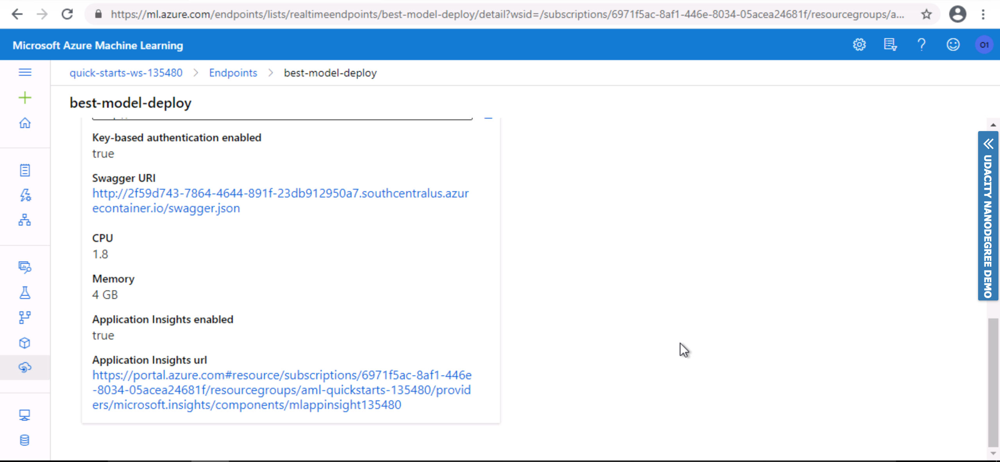

# Project: Operationalizing Machine Learning

## Table of content
* [Overview](#overview)
* [Architectural Diagram](#architectural-diagram)
* [Key Steps](#key-steps)
* [Screen Recording](#screen-recording)
* [Future work](#standout-suggestions)

## Overview
In this project, we will use the Bank Marketing dataset. This dataset shows information about the marketing campaign of a bank. The aim of the analysis is to predict potential customers who are willing to contribute to the bank's future loan or deposit plans. Hence, improving the overall future performance. We will use Azure to configure a cloud-based machine learning production model, deploy it, and consume it. We will also create, publish, and consume a pipeline. 

## Architectural Diagram

The diagram below shows the steps followed in implementing the project:

- Authentication: Create a Security Principal to associate with the Azure Workspace.
- Automated ML Experiment: Create experiment using Automated ML, configure a compute cluster, and use that cluster to run the experiment.
- Cleaning & Training the model: Automl will validate and clean the data then train it with several algorithms. 
- Deploy the best model: Deploy the model with the highest accuracy rate and move it to production.
- Enable insights & logging: To monitor model behavior and get detailed information about the running processes. 
- Swagger Documentation : Consume the deployed model using Swagger.
- Interact with model & benchmark: consume the endpoint using test records by running enpoint.py script, load and test the model using benchmark.sh script.
- Create & publish pipeline: Create & publishing a pipeline using Python SDK. 

## Key Steps

#### Step 1: Authentication
Since I worked with Udacity lab, I have skipped this step as I'm not authorized to create a security principal. 

#### Step 2: Automated ML Experiment
In this step, I have created a new experiment using Automated ML and the bank marketing registered dataset, created and configured a compute cluster, and used it to run the experiment.

###### Registerd Dataset Screenshot

##### Creating Automl Experiment Screenshot

##### Automl Experiment Completed Screenshot

##### Best Model Screenshot
The best model was a VotingEnsemble pipeline with 0.918 accuracy rate. 

#### Step 3: Deploy the Best Model
In this step, I deployed the best model while enabling authentication and ACI Instance. Later, the deployed model showed in the endpoints section.

##### Deploy Best Model Screenshot

##### Deployed Model Endpoint Screenshot

#### Step 4: Enable Application Insights
From the deployed model, I have enabled application insights and retrieve logs. This step will help in detecting failures, anomalies...etc in the model.

##### Before Enabling Application Insights Screenshot

##### After Enabling Application Insights Screenshot

##### Enable Logs by running logs.py script Screenshot

#### Step 5: Swagger Documentation
A swagger is a tool used to document and consume RESTful web services with APIs in GET & POST HTTP requests. To enable swagger I have run serve.py script in port 8000 and swagger.sh in port 9000. Then, interact with the swagger instance and retrieve its response from localhost. 

##### Running swagger.sh Screenshot

##### API Interaction Screenshot

#### Step 6: Consume Model Endpoints
In this step, I have interacted with the trained model using endpoint.py script updating the score url & Key. After running the code, it produced a JSON output response. Also, to load & test my model, I executed the benchmark bash script. 

##### Consume Endpoint Screenshot

##### Benchmark Screenshot

#### Step 7: Create, Publish and Consume a Pipeline
I have updated the Jupyter Notebook with the dataset, cluster, keys, and model names and created the pipline.Then, published the pipeline using python SDK.

##### Creating Pipeline Screenshot

##### RunDetails Widget of the Pipeline Screenshot

##### Completed Pipelines Screenshot

##### Rest Pipeline from pyhon SDK Screenshot

##### Published Pipeline showing a REST endpoint Screenshot

## Screen Recording
[Click Here](https://www.loom.com/share/71e5770326d34e2da6be697d85df232f)

## Standout Suggestions
* I would resolve the imbalance issue in the dataset to prevent the bias that could impact the prediction. This type of issue is common in Classification problems.
* I would try enabling azure ml features such as deep learning option when training the model, this could improve the accuracy. 
* Test the model with new records and evaluate the model behavior instead of the existing records.

